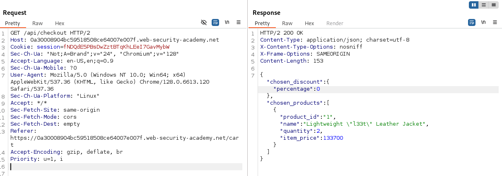
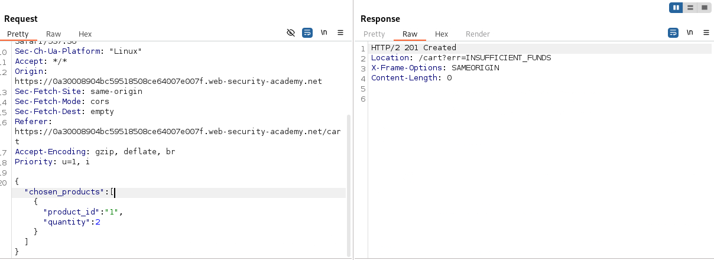
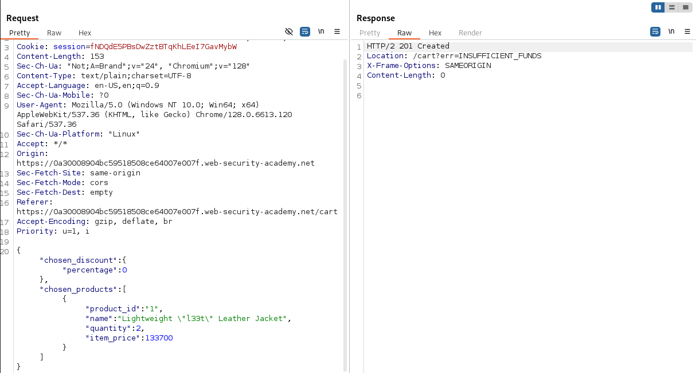

# Lab: Exploiting a mass assignment vulnerability

## Question

To solve the lab, find and exploit a mass assignment vulnerability to buy a **Lightweight l33t Leather Jacket**. You can log in to your own account using the following credentials: `wiener:peter`.

> **Required knowledge**
> To solve this lab, you'll need to know:
> - What mass assignment is.
> - Why mass assignment may result in hidden parameters.
> - How to identify hidden parameters.
> - How to exploit mass assignment vulnerabilities.
>
> These points are covered in our API Testing Academy topic.

---

## Answer

Chúng ta được cung cấp tài khoản và mật khẩu user wiener để đăng nhập vào hệ thống. Dạo qua một vòng và sử dụng các chức năng của website để ghi lại các request history bằng burpsuite.

Sau khi sử dụng các chức năng để ghi lại http history. Kiểm tra trong burpsuite ta thấy có một API khá tiềm năng:

```text
GET /api/checkout HTTP/2
```



Và một API khác nữa để sử lý quá trình thanh toán:

```text
POST /api/checkout HTTP/2
```



Thay đổi HTTP method trên API này thành `PATCH`, chúng ta thấy thông báo lỗi. Vậy là không thể cập nhật thông tin sản phẩm qua API này.

Nhưng dựa vào thông tin trả về ở method `GET`, chúng ta thấy server trả về thông tin sản phẩm và một số thông tin đi kèm:

```json
{"chosen_discount":{"percentage":0},"chosen_products":[{"product_id":"1","name":"Lightweight \"l33t\" Leather Jacket","quantity":2,"item_price":133700}]}
```

Thử đưa thông tin trên vào phần body của request method POST



Không có lỗi trả về, vậy là khả năng cao gửi request thành công với thông tin đi kèm trong phần body.

Trong body vừa rồi có thông tin `chosen_discount` là mã giảm giá đã chọn và tỷ lệ giảm giá là 0. Sửa giá trị thành 100 và gửi lại request.

```json
{"chosen_discount":{"percentage":100},"chosen_products":[{"product_id":"1","name":"Lightweight \"l33t\" Leather Jacket","quantity":2,"item_price":133700}]}
```

Nice done~~
