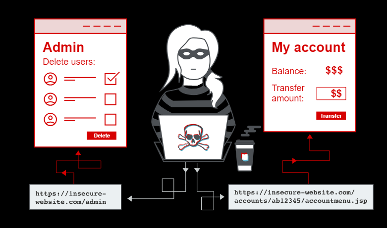

# What is access control

## Tables of content

- [What is access control](#what-is-access-control-1)
- [Vertical privilege escalation](#vertical-privilege-escalation)
- [Unprotected functionality](#unprotected-functionality)
- [Lab: Unprotected admin functionality](#lab-unprotected-admin-functionality)
- [Unprotected functionality - Continued](#unprotected-functionality---continued)
- [Lab: Unprotected admin functionality with unpredictable URL](#lab-unprotected-admin-functionality-with-unpredictable-url)
- [Parameter-based access control methods](#parameter-based-access-control-methods)
- [Lab: User role controlled by request parameter](#lab-user-role-controlled-by-request-parameter)
- [Horizontal privilege escalation](#horizontal-privilege-escalation)
- [Lab: User ID controlled by request parameter, with unpredictable user IDs](#lab-user-id-controlled-by-request-parameter-with-unpredictable-user-ids)
- [Horizontal to vertical privilege escalation](#horizontal-to-vertical-privilege-escalation)
- [Lab: User ID controlled by request parameter with password disclosure](#lab-user-id-controlled-by-request-parameter-with-password-disclosure)

---

## What is access control?

Access control is the application of constraints on who or what is authorized to perform actions or access resources. In the context of web applications, access control is dependent on authentication and session management:

- **Authentication** confirms that the user is who they say they are.
- **Session management** identifies which subsequent HTTP requests are being made by that same user.
- **Access control** determines whether the user is allowed to carry out the action that they are attempting to perform.

Broken access controls are common and often present a critical security vulnerability. Design and management of access controls is a complex and dynamic problem that applies business, organizational, and legal constraints to a technical implementation. Access control design decisions have to be made by humans so the potential for errors is high.



---

## Vertical privilege escalation

If a user can gain access to functionality that they are not permitted to access then this is vertical privilege escalation. For example, if a non-administrative user can gain access to an admin page where they can delete user accounts, then this is vertical privilege escalation.

## Unprotected functionality

At its most basic, vertical privilege escalation arises where an application does not enforce any protection for sensitive functionality. For example, administrative functions might be linked from an administrator's welcome page but not from a user's welcome page. However, a user might be able to access the administrative functions by browsing to the relevant admin URL.

For example, a website might host sensitive functionality at the following URL:

```text
https://insecure-website.com/admin
```

This might be accessible by any user, not only administrative users who have a link to the functionality in their user interface. In some cases, the administrative URL might be disclosed in other locations, such as the `robots.txt` file:

```text
https://insecure-website.com/robots.txt
```

Even if the URL isn't disclosed anywhere, an attacker may be able to use a wordlist to brute-force the location of the sensitive functionality.

---

## Lab: Unprotected admin functionality

This lab has an unprotected admin panel.  
Solve the lab by deleting the user carlos.

[write up](02_Lab_Unprotected_admin_functionality.md)

---

## Unprotected functionality - Continued

In some cases, sensitive functionality is concealed by giving it a less predictable URL. This is an example of so-called "security by obscurity". However, hiding sensitive functionality does not provide effective access control because users might discover the obfuscated URL in a number of ways.

Imagine an application that hosts administrative functions at the following URL:

```text
https://insecure-website.com/administrator-panel-yb556
```

This might not be directly guessable by an attacker. However, the application might still leak the URL to users. The URL might be disclosed in JavaScript that constructs the user interface based on the user's role:

```js
<script>
    var isAdmin = false;
    if (isAdmin) {
        ...
        var adminPanelTag = document.createElement('a');
        adminPanelTag.setAttribute('https://insecure-website.com/administrator-panel-yb556');
        adminPanelTag.innerText = 'Admin panel';
        ...
    }
</script>
```

This script adds a link to the user's UI if they are an admin user. However, the script containing the URL is visible to all users regardless of their role.

---

## Lab: Unprotected admin functionality with unpredictable URL

This lab has an unprotected admin panel. It's located at an unpredictable location, but the location is disclosed somewhere in the application.

Solve the lab by accessing the admin panel, and using it to delete the user `carlos`.

[write up](02_Lab_Unprotected_admin_functionality_with_unpredictable_URL.md)

---

## Parameter-based access control methods

Some applications determine the user's access rights or role at login, and then store this information in a user-controllable location. This could be:

- A hidden field.
- A cookie.
- A preset query string parameter.

The application makes access control decisions based on the submitted value. For example:

```text
https://insecure-website.com/login/home.jsp?admin=true
https://insecure-website.com/login/home.jsp?role=1
```

This approach is insecure because a user can modify the value and access functionality they're not authorized to, such as administrative functions.

---

## Lab: User role controlled by request parameter

This lab has an admin panel at `/admin`, which identifies administrators using a forgeable cookie.

Solve the lab by accessing the admin panel and using it to delete the user `carlos`.

You can log in to your own account using the following credentials: `wiener:peter`

[write up](02_Lab_User_role_controlled_by_request_parameter.md)

---

## Horizontal privilege escalation

Horizontal privilege escalation occurs if a user is able to gain access to resources belonging to another user, instead of their own resources of that type. For example, if an employee can access the records of other employees as well as their own, then this is horizontal privilege escalation.

Horizontal privilege escalation attacks may use similar types of exploit methods to vertical privilege escalation. For example, a user might access their own account page using the following URL:

```text
https://insecure-website.com/myaccount?id=123
```

If an attacker modifies the `id` parameter value to that of another user, they might gain access to another user's account page, and the associated data and functions.

> **Note**
>
> This is an example of an insecure direct object reference (IDOR) vulnerability. This type of vulnerability arises where user-controller parameter values are used to access resources or functions directly.

In some applications, the exploitable parameter does not have a predictable value. For example, instead of an incrementing number, an application might use globally unique identifiers (GUIDs) to identify users. This may prevent an attacker from guessing or predicting another user's identifier. However, the GUIDs belonging to other users might be disclosed elsewhere in the application where users are referenced, such as user messages or reviews.

---

## Lab: User ID controlled by request parameter, with unpredictable user IDs

This lab has a horizontal privilege escalation vulnerability on the user account page, but identifies users with GUIDs.

To solve the lab, find the GUID for `carlos`, then submit his API key as the solution.

You can log in to your own account using the following credentials: `wiener:peter`

[write up](02_Lab_User_ID_controlled_by_request_parameter_with_unpredictable_user_IDs.md)

---

## Horizontal to vertical privilege escalation

Often, a horizontal privilege escalation attack can be turned into a vertical privilege escalation, by compromising a more privileged user. For example, a horizontal escalation might allow an attacker to reset or capture the password belonging to another user. If the attacker targets an administrative user and compromises their account, then they can gain administrative access and so perform vertical privilege escalation.

An attacker might be able to gain access to another user's account page using the parameter tampering technique already described for horizontal privilege escalation:

```url
https://insecure-website.com/myaccount?id=456
```

If the target user is an application administrator, then the attacker will gain access to an administrative account page. This page might disclose the administrator's password or provide a means of changing it, or might provide direct access to privileged functionality.

---

## Lab: User ID controlled by request parameter with password disclosure

This lab has user account page that contains the current user's existing password, prefilled in a masked input.

To solve the lab, retrieve the administrator's password, then use it to delete the user `carlos`.

You can log in to your own account using the following credentials: `wiener:peter`

[write up](02_Lab_User_ID_controlled_by_request_parameter_with_password_disclosure.md)
