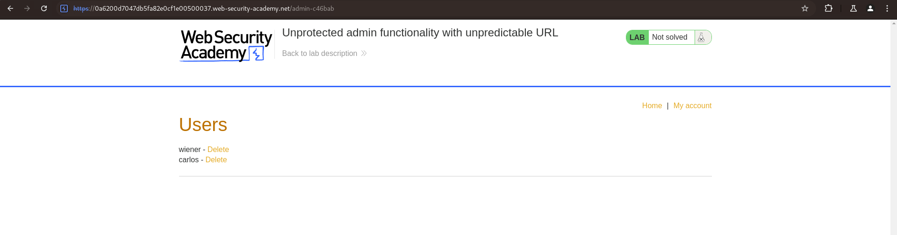

# Lab: Unprotected admin functionality with unpredictable URL

## Question

This lab has an unprotected admin panel. It's located at an unpredictable location, but the location is disclosed somewhere in the application.

Solve the lab by accessing the admin panel, and using it to delete the user `carlos`.

---

## Answer

Thực hiện login, ta tìm thấy đoạn script:

```js
<script>
var isAdmin = false;
if (isAdmin) {
   var topLinksTag = document.getElementsByClassName("top-links")[0];
   var adminPanelTag = document.createElement('a');
   adminPanelTag.setAttribute('href', '/admin-c46bab');
   adminPanelTag.innerText = 'Admin panel';
   topLinksTag.append(adminPanelTag);
   var pTag = document.createElement('p');
   pTag.innerText = '|';
   topLinksTag.appendChild(pTag);
}
</script>
```

Đoạn script trên kiểm tra nếu đăng nhập là admin thfi chuyển tới tab /`admin-c46bab`

Truy cập vào page:

```text
https://0a6200d7047db5fa82e0cf1e00500037.web-security-academy.net/admin-c46bab
```



Done~~
