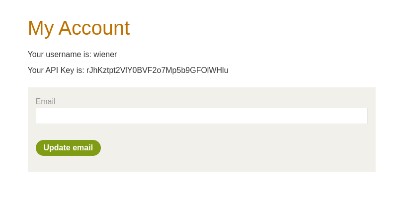
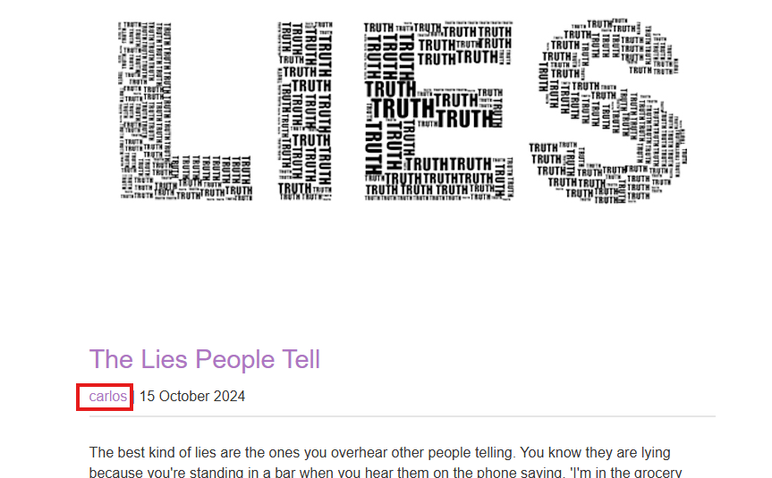

# Lab: User ID controlled by request parameter, with unpredictable user IDs

## Question

This lab has a horizontal privilege escalation vulnerability on the user account page, but identifies users with GUIDs.

To solve the lab, find the GUID for `carlos`, then submit his API key as the solution.

You can log in to your own account using the following credentials: `wiener:peter`

## Answer

Truy cập trang mục tiêu, có chứa các bài đăng với bình luận từ user khác.

Thực hiện đăng nhập bằng tài khoản `wiener:peter`

Sau khi đăng nhập, nhận được API key của tài khoản:



Và cũng nhận thấy URL của trang user là api key của mình:

```text
https://0ae600db03f1bcad800326c5005700e4.web-security-academy.net/my-account?id=54814f91-6513-4a43-ad30-93e8fdb9dfad
```

Trong mỗi blog bài viết sẽ có thông tin username của tác giả và đường link tới trang cá nhân của họ:



```html
<p>
    <span id=blog-author>
        <a href='/blogs?userId=fe02af42-cc9c-4aa2-9aed-8be9eb55095f'>
            carlos
        </a>
    </span> | 15 October 2024
</p>
```

Sử dụng api trên để truy cập trang cá nhân của carlos:

```text
https://0ae600db03f1bcad800326c5005700e4.web-security-academy.net/my-account?id=fe02af42-cc9c-4aa2-9aed-8be9eb55095f
```

Success~~

Nhập API key và done~~
