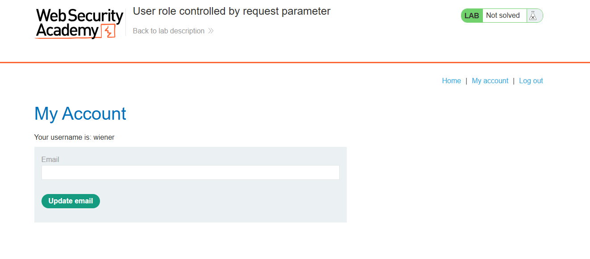
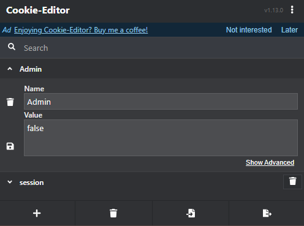
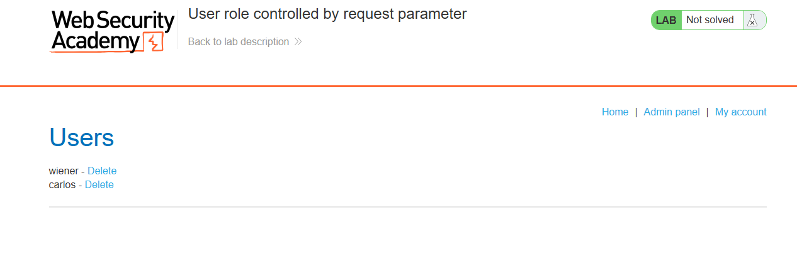

# Lab: User role controlled by request parameter

## Question

This lab has an admin panel at `/admin`, which identifies administrators using a forgeable cookie.

Solve the lab by accessing the admin panel and using it to delete the user `carlos`.

You can log in to your own account using the following credentials: `wiener:peter`

## Answer

Đăng nhập vào tài khoản khoản wiener được cấp

Kiểm tra cookie ứng dụng, nhận thấy có trường `Admin`

Sửa giá trị từ false -> true.

Truy cập trang `/admin`:

Done~
