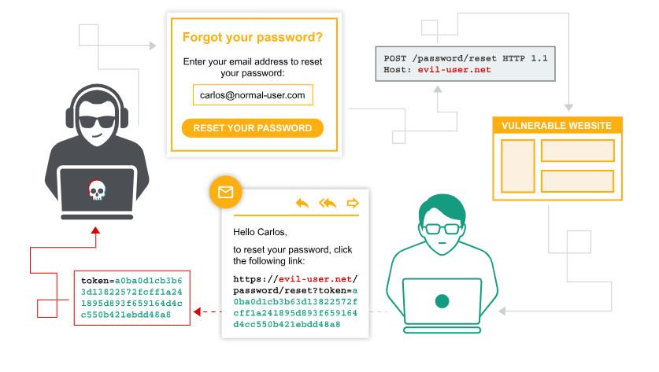
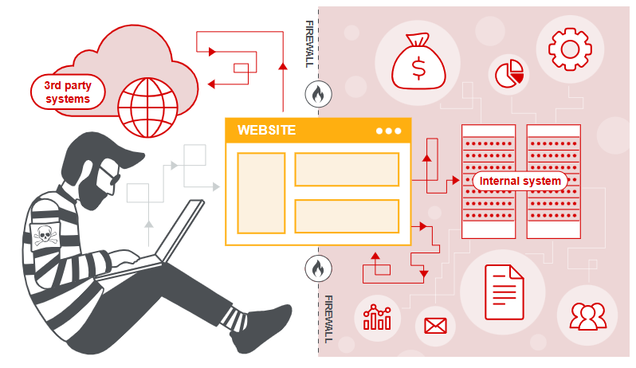

# Authentication

## Table of contents

---

## Authentication vulnerabilities

Conceptually, authentication vulnerabilities are easy to understand. However, they are usually critical because of the clear relationship between authentication and security.

Authentication vulnerabilities can allow attackers to gain access to sensitive data and functionality. They also expose additional attack surface for further exploits. For this reason, it's important to learn how to identify and exploit authentication vulnerabilities, and how to bypass common protection measures.

In this section, we explain:

- The most common authentication mechanisms used by websites.
- Potential vulnerabilities in these mechanisms.
- Inherent vulnerabilities in different authentication mechanisms.
- Typical vulnerabilities that are introduced by their improper implementation.
- How you can make your own authentication mechanisms as robust as possible.

---

## What is the difference between authentication and authorization?

Authentication is the process of verifying that a user is who they claim to be. Authorization involves verifying whether a user is allowed to do something.

For example, authentication determines whether someone attempting to access a website with the username `Carlos123` really is the same person who created the account.

Once `Carlos123` is authenticated, their permissions determine what they are authorized to do. For example, they may be authorized to access personal information about other users, or perform actions such as deleting another user's account.

---

## Brute-force attacks

A brute-force attack is when an attacker uses a system of trial and error to guess valid user credentials. These attacks are typically automated using wordlists of usernames and passwords. Automating this process, especially using dedicated tools, potentially enables an attacker to make vast numbers of login attempts at high speed.

Brute-forcing is not always just a case of making completely random guesses at usernames and passwords. By also using basic logic or publicly available knowledge, attackers can fine-tune brute-force attacks to make much more educated guesses. This considerably increases the efficiency of such attacks. Websites that rely on password-based login as their sole method of authenticating users can be highly vulnerable if they do not implement sufficient brute-force protection.

---

## Brute-forcing usernames

Usernames are especially easy to guess if they conform to a recognizable pattern, such as an email address. For example, it is very common to see business logins in the format `firstname.lastname@somecompany.com`. However, even if there is no obvious pattern, sometimes even high-privileged accounts are created using predictable usernames, such as `admin` or `administrator`.

During auditing, check whether the website discloses potential usernames publicly. For example, are you able to access user profiles without logging in? Even if the actual content of the profiles is hidden, the name used in the profile is sometimes the same as the login username. You should also check HTTP responses to see if any email addresses are disclosed. Occasionally, responses contain email addresses of high-privileged users, such as administrators or IT support.

---

## Brute-forcing passwords

Passwords can similarly be brute-forced, with the difficulty varying based on the strength of the password. Many websites adopt some form of password policy, which forces users to create high-entropy passwords that are, theoretically at least, harder to crack using brute-force alone. This typically involves enforcing passwords with:

- A minimum number of characters
- A mixture of lower and uppercase letters
- At least one special character

---

## Brute-forcing passwords - Continued

However, while high-entropy passwords are difficult for computers alone to crack, we can use a basic knowledge of human behavior to exploit the vulnerabilities that users unwittingly introduce to this system. Rather than creating a strong password with a random combination of characters, users often take a password that they can remember and try to crowbar it into fitting the password policy. For example, if mypassword is not allowed, users may try something like `Mypassword1!` or `Myp4$$w0rd` instead.

In cases where the policy requires users to change their passwords on a regular basis, it is also common for users to just make minor, predictable changes to their preferred password. For example, Mypassword1! becomes Mypassword1? or Mypassword2!.

This knowledge of likely credentials and predictable patterns means that brute-force attacks can often be much more sophisticated, and therefore effective, than simply iterating through every possible combination of characters.

---

## Username enumeration

Username enumeration is when an attacker is able to observe changes in the website's behavior in order to identify whether a given username is valid.

Username enumeration typically occurs either on the login page, for example, when you enter a valid username but an incorrect password, or on registration forms when you enter a username that is already taken. This greatly reduces the time and effort required to brute-force a login because the attacker is able to quickly generate a shortlist of valid usernames.

---

## Lab: Username enumeration via different responses

This lab is vulnerable to username enumeration and password brute-force attacks. It has an account with a predictable username and password, which can be found in the following wordlists:

- [Candidate usernames](https://portswigger.net/web-security/authentication/auth-lab-usernames) | [local file](../Authentication_lab_usernames.txt)
- [Candidate passwords](https://portswigger.net/web-security/authentication/auth-lab-passwords) | [local file](../Authentication_lab_passwords.txt)

To solve the lab, enumerate a valid username, brute-force this user's password, then access their account page.

[write up](03_Lab_Username_enumeration_via_different_responses.md)

---

## Bypassing two-factor authentication

At times, the implementation of two-factor authentication is flawed to the point where it can be bypassed entirely.

If the user is first prompted to enter a password, and then prompted to enter a verification code on a separate page, the user is effectively in a "logged in" state before they have entered the verification code. In this case, it is worth testing to see if you can directly skip to "logged-in only" pages after completing the first authentication step. Occasionally, you will find that a website doesn't actually check whether or not you completed the second step before loading the page.

---

## Lab: 2FA simple bypass

This lab's two-factor authentication can be bypassed. You have already obtained a valid username and password, but do not have access to the user's 2FA verification code. To solve the lab, access Carlos's account page.

- Your credentials: `wiener:peter`
- Victim's credentials `carlos:montoya`

[write up](03_Lab_2FA_simple_bypass.md)

---

## What is SSRF?

Server-side request forgery is a web security vulnerability that allows an attacker to cause the server-side application to make requests to an unintended location.

In a typical SSRF attack, the attacker might cause the server to make a connection to internal-only services within the organization's infrastructure. In other cases, they may be able to force the server to connect to arbitrary external systems. This could leak sensitive data, such as authorization credentials.

---

## SSRF attacks against the server

