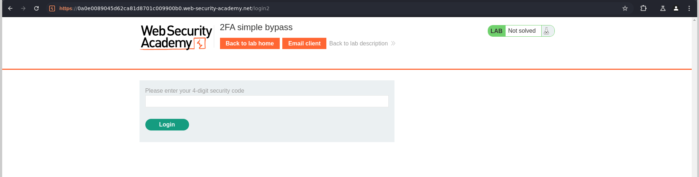
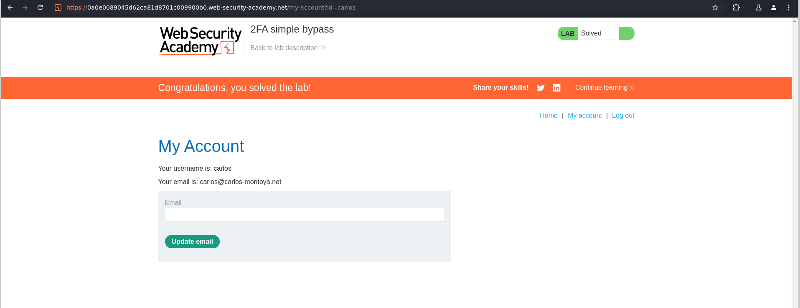

# Lab: 2FA simple bypass

## Question

This lab's two-factor authentication can be bypassed. You have already obtained a valid username and password, but do not have access to the user's 2FA verification code. To solve the lab, access Carlos's account page.

- Your credentials: `wiener:peter`
- Victim's credentials `carlos:montoya`

## Answer

Đăng nhập với tài khoản wiener, sau khi nhập tài khoản mật khẩu thì được chuyển hướng tới `/login2` để thực hiện 2FA

Sử dụng button chuyển hướng tới mail wiener - chỉ wiener được dùng trong lab này. Lấy code 2FA và đăng nhập. Sau khi đăng nhập được chuyển hướng tới trang user:

```url
https://0a0e0089045d62ca81d8701c009900b0.web-security-academy.net/my-account?id=wiener
```

Để đăng nhập vào tài khoản `carlos` với mật khẩu `montoya`. Quay lại trang đăng nhập:

Nhập `username:password`



Bypass bằng cách truy cập link trang người dùng với id `carlos`:

```url
https://0a0e0089045d62ca81d8701c009900b0.web-security-academy.net/my-account?id=carlos
```



Done~
