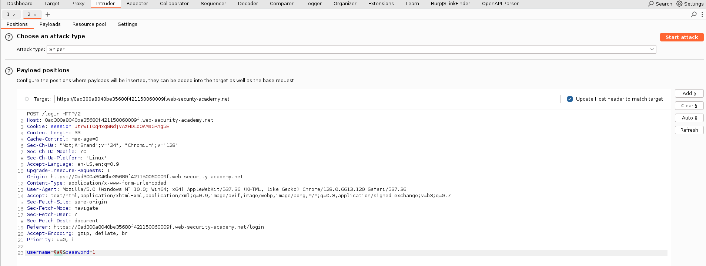
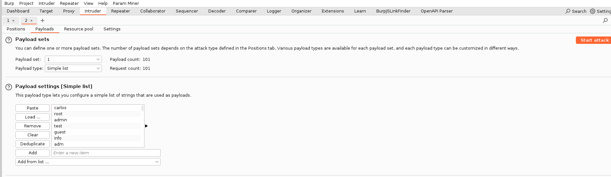
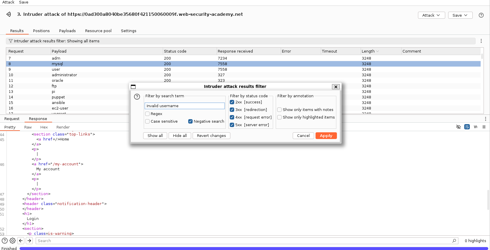
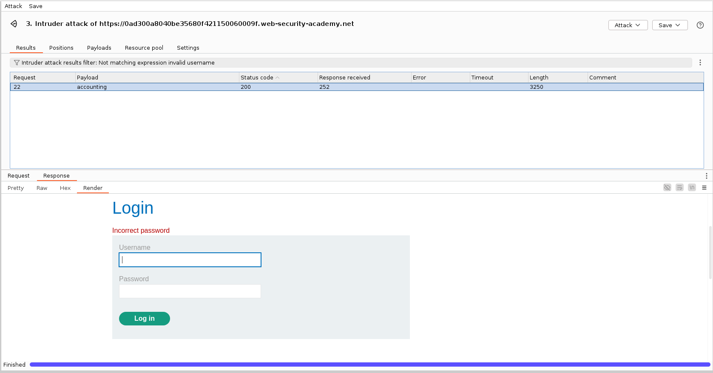
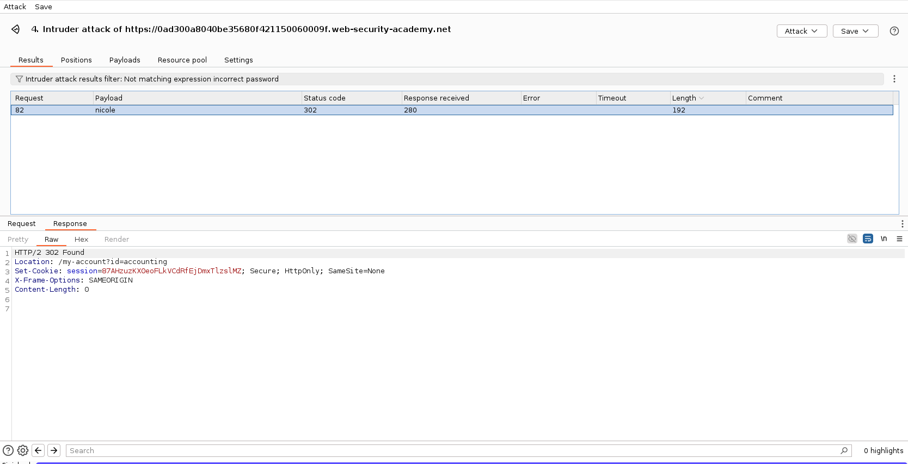
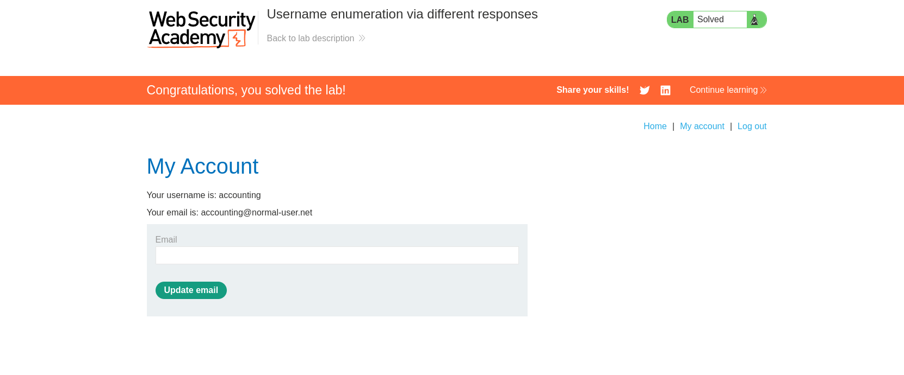

# Lab: Username enumeration via different responses

## Question

This lab is vulnerable to username enumeration and password brute-force attacks. It has an account with a predictable username and password, which can be found in the following wordlists:

- [Candidate usernames](https://portswigger.net/web-security/authentication/auth-lab-usernames) | [local file](../Authentication_lab_usernames.txt)
- [Candidate passwords](https://portswigger.net/web-security/authentication/auth-lab-passwords) | [local file](../Authentication_lab_passwords.txt)

To solve the lab, enumerate a valid username, brute-force this user's password, then access their account page.

---

## Answer

Thực hiện đăng nhập với tài khoản mật khẩu bất kỳ, kiểm tra request / reponse:

Chúng ta nhận được phản hồi:

```html
<p class=is-warning>Invalid username</p>
```

Sử dụng Intruder, dùng word list được cung cấp và bruteforce:





Sau khi hoàn thành, dùng bộ lọc để tìm thông tin cần thiết:



Có một payload username là `accounting`, response là `Incorrect password`:



Sử dụng username `accounting` và tiến hành bruteforce password:

Tiếp tục sử dụng bộ lọc, tìm ra một phản hồi khác với các phản hồi `Incorrect password`:



Chuyển qua repeater, gửi request với username:password `accounting:nicole`



Done~
