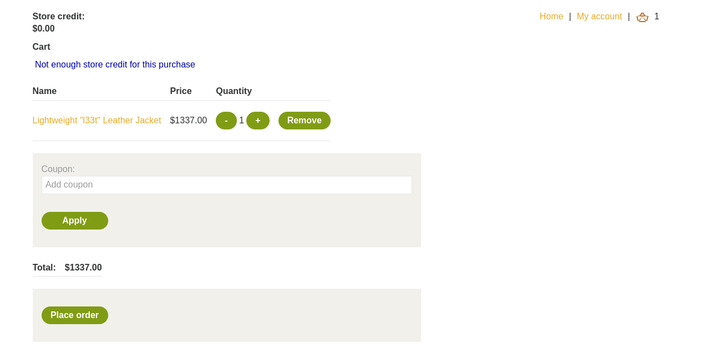
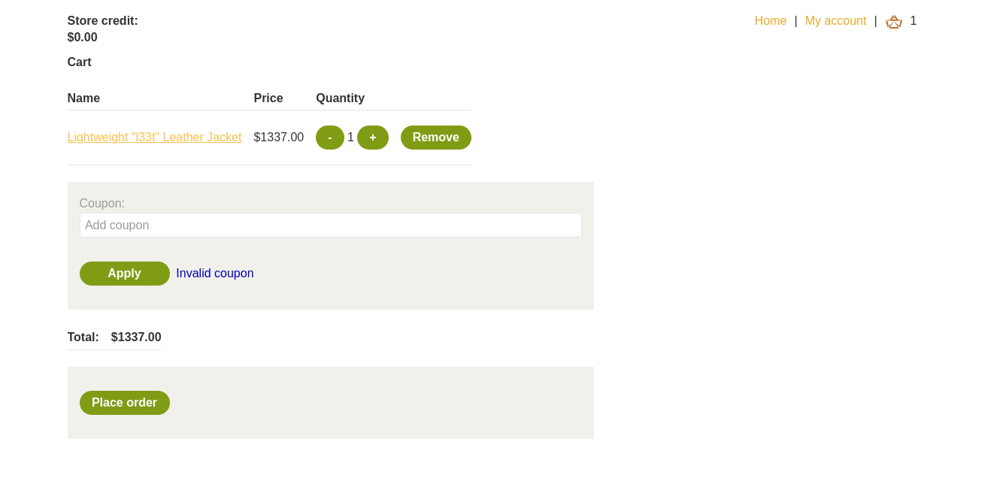
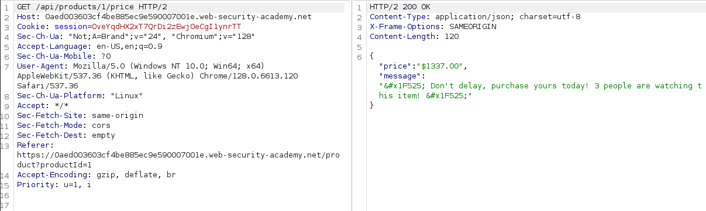
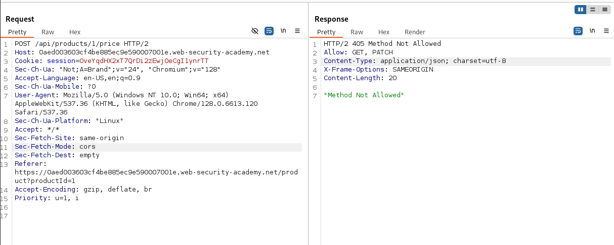
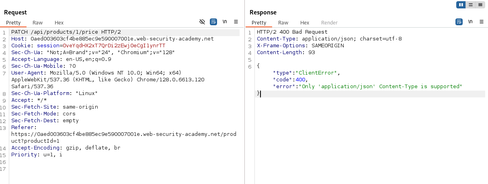
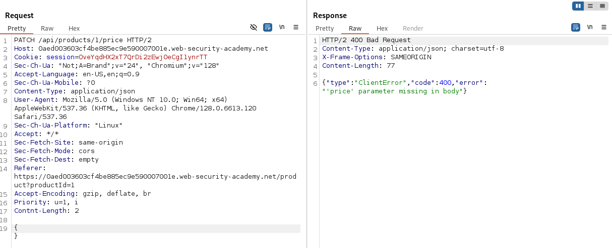
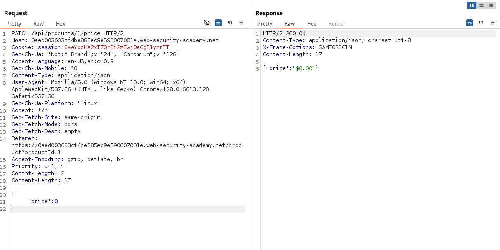
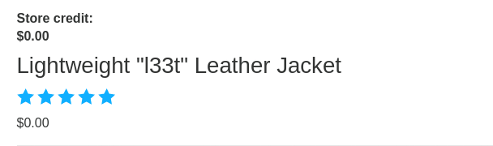

# Lab: Finding and exploiting an unused API endpoint

## Question

To solve the lab, exploit a hidden API endpoint to buy a **Lightweight l33t Leather Jacket**. You can log in to your own account using the following credentials: `wiener:peter`.

> **Required knowledge**  
> To solve this lab, you'll need to know:
> - How to use error messages to construct a valid request.
> - How HTTP methods are used by RESTful APIs.
> - How changing the HTTP method can reveal additional functionality.
> 
> These points are covered in our API Testing Academy topic.

---

## Answer

Dạo quanh trang web mục tiêu một lượt, ta thấy đây là một website bán hàng.  

Cơ bản có một số chức năng như xem thông tin hàng, thêm vào giỏ hàng, đăng nhập, thanh toán, sử dụng coupon giảm giá.

Thử thêm hàng vào giỏi và thực hiện thanh toán.



Tất nhiên sẽ không đủ credit.

Giờ nhập đại 1 coupon kiểm tra.



Thông báo `invalid coupon`

Ở trong Burp Proxy, ta thấy có một request tới API sau



Thử thay đổi HTTP method GET -> POST:



Ta thấy thông báo lỗi và HTTP header cho thấy cho phép 2 phương thức là GET và PATCH.



Đổi phương thức PATCH, ta thấy thông báo lỗi:

```JSON
{"type":"ClientError","code":400,"error":"Only 'application/json' Content-Type is supported"}
```

Có manh mối tiếp theo, chỉ cần đổi header Content-Type thành application/json và thêm phần {} vào body.



Server trả về thông báo lỗi rõ ràng cho thấy do thiếu parameter price.

```json
{"type":"ClientError","code":400,"error":"'price' parameter missing in body"}
```

Ta đã biết PATCH để cập nhật một phần thông tin của đối tượng, như vậy thì request này có tác dụng cập nhật giá trị param `'price'`.



```json
{"price":"$0.00"}
```

Thành công cập nhật giá sản phẩm.



Giờ chỉ việc tiến hành thêm vào giỏ hàng và thanh toán.

Done~~
