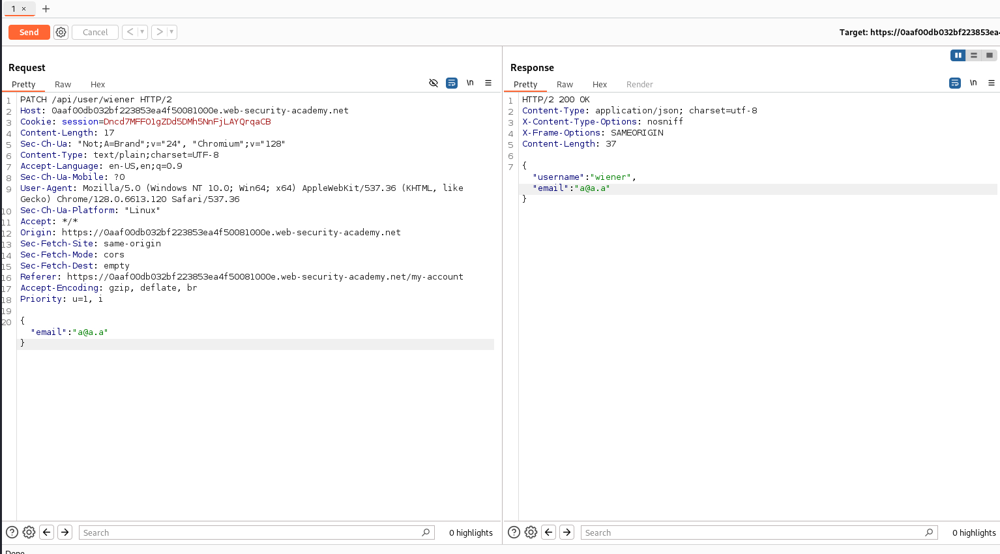

# Lab: Exploiting an API endpoint using documentation

---

## Details

To solve the lab, find the exposed API documentation and delete `carlos`. You can log in to your own account using the following credentials: `wiener:peter`.

---

## Solution

Sau khi truy cập web, sử dụng tài khoản được cung cấp để đăng nhập vào hệ thống.


Sau khi đăng nhập thì ta thấy giao diện dashboard sau:


Có một chức năng khá thú vị ở đây là thay đổi email. Thử sử dụng chức năng này để đổi một email và kiểm tra request. Ta phát hiện một api khá tiềm năng:


```
PATCH /api/user/wiener
```



Đổi HTTP method thành GET và bắt đầu dò tìm base path, ta thu được một API path:

```
GET /api/
```


Bingo~~

Khám phá chức năng của API documentation, ta tìm được API sử dụng để xóa tài khoản cần tìm.

Bước cuối chỉ cần nhập username carlos và gửi request:


Done


