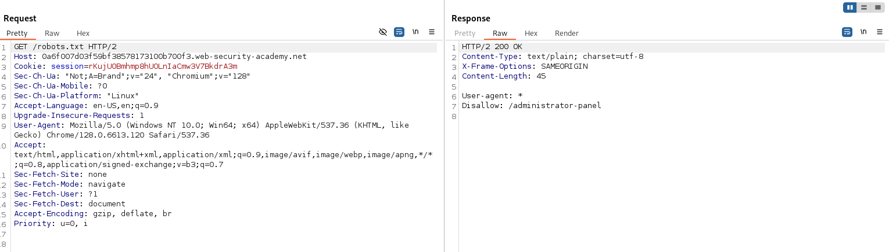
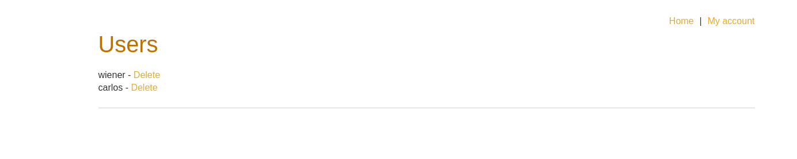

# Lab: Unprotected admin functionality

## Question

This lab has an unprotected admin panel.  
Solve the lab by deleting the user carlos.

---

## Answer

Sử dụng một số công cụ dò quét dễ dàng tìm được file `robots.txt`.

```text
https://0a6f007d03f59bf38578173100b700f3.web-security-academy.net/robots.txt
```

```text
User-agent: *
Disallow: /administrator-panel
```



Trong file `robots.txt` tìm được đường dẫn tới bảng điều khiển admin.

```text
https://0a6f007d03f59bf38578173100b700f3.web-security-academy.net/administrator-panel
```



Do đường dẫn và các chức năng này không được bảo vệ nên có thể thực hiện xóa người dùng mà không cần có quyền admin.

Done~
